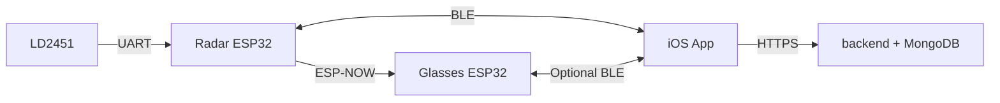

# HackMIT China 2026 — Smart Cycling Safety System

**Other languages:** [中文](README.zh.md)

This document is for anyone who needs to **understand the layout, workflow, and how to run** the project.

**Example repository root:** `/Users/a11/Documents/HackMITChina2026 finish`

```
HackMITChina2026 finish/
├── 3D printing file/          # 3D-printed mechanical parts
├── hardware/
│   └── components.txt         # BOM / parts list
└── firmware/
    ├── backend/               # Node.js + MongoDB API (Docker)
    ├── bicycle app/           # Xcode / SwiftUI iPhone app
    ├── glassess/              # Radar bridge ESP32 firmware (.ino)
    └── millimeter-Radar/      # Same radar logic (PlatformIO; recommended for build/flash)
```

---

## 1. What the system does (workflow)

1. **LD2451 mmWave radar** sends targets (angle, distance, speed, approaching flag, etc.) over UART to the **radar ESP32** (bridge logic in `millimeter-Radar` / `glassess`).
2. **Radar ESP32**  
   - Parses radar frames and picks threatening targets;  
   - Pushes **JSON lines** to the iPhone over **BLE**;  
   - Sends target data to the **glasses ESP32** via **ESP-NOW**;  
   - Accepts phone commands such as **`NAV,*`** (navigation) and **`BRAKE,*`** (brake / decel hint).
3. **Glasses ESP32** (second C3; firmware drives glasses / left-right LEDs) receives targets and nav packets over ESP-NOW and drives **warning and turn-guide lights**.
4. **iPhone app** (`bicycle app`)  
   - Connects over Bluetooth to the radar bridge (or another peripheral with the same BLE service);  
   - **Map:** search, routing, **Start navigation** → turn commands over BLE;  
   - **Safety:** danger index, latest target, local danger log;  
   - **Device:** scan, connect, RSSI, frame counters;  
   - **People:** invite-code guardian linking and remote danger data (needs backend);  
   - **Profile / Settings:** account, Chinese/English UI, invite code; **AI riding insights** is a **UI demo only**, not a real model.
5. **Backend** (`firmware/backend`)  
   - Register/login (JWT), mutual watch list via invite codes;  
   - Ingests radar scans from the app, computes danger score, stores and queries records.



---

## 2. Hardware (from `hardware/components.txt`)

| Part | Notes |
|------|--------|
| ESP32-C3 ×2 | One radar bridge, one glasses / LED control (wiring as built) |
| LD2451 mmWave radar ×1 | UART target frames |
| Flexible LCD lens (with UV sensor) ×1 | Per your mechanical/electrical design |
| Batteries ×2 | Power |
| Red / blue LED strips ×2 each | Status / warning |
| Type-C charging modules ×2 | Charging |
| 3D printing materials | See `3D printing file/` |

Pinout and wiring follow your firmware and actual build. **ESP-NOW peer MAC** is set in the radar bridge code and must match the glasses board STA MAC before flashing.

---

## 3. How to run each part

### 3.1 Backend — `firmware/backend`

**Stack:** Express 5, Mongoose, MongoDB, JWT; start with **Docker Compose**.

```bash
cd "/Users/a11/Documents/HackMITChina2026 finish/firmware/backend"
docker compose up -d --build
```

- API default port: **3000**  
- MongoDB port: **27017** (often published for dev; **do not** expose an unsecured DB to the public internet)

**Health check:** open `http://<server-ip>:3000/` — you should see JSON with `status: ok`.

**Main API prefixes:**

- `POST /api/auth/register`, `POST /api/auth/login`  
- `POST /api/auth/watch`, `GET /api/auth/watchlist`, `GET /api/auth/me`  
- `POST /api/radar/scan`, `GET /api/radar/danger`, etc. (Bearer token required)

See `firmware/backend/docs/` if present.

---

### 3.2 iOS app — `firmware/bicycle app`

**Open:** `bicycle app.xcodeproj`. Use a **physical iPhone** for Bluetooth and location.

**Backend URL:** edit `appBackendBaseURL` in `bicycle app/AuthService.swift`. The repo may contain an example like:

```swift
let appBackendBaseURL = "http://172.16.23.215:3000"
```

Set this to your **host machine’s LAN IP** running Docker, on the same network as the phone. For **HTTP**, add an **App Transport Security exception** in Xcode **Info** for that host/IP.

**Permissions:** Bluetooth, location (map/navigation and some motion-based logic), network.

**Typical app flow:**

1. Backend up; phone can reach the API.  
2. **Register / log in** in the app.  
3. **Device:** enable Bluetooth → scan → connect the radar bridge peripheral.  
4. **Map:** search destination → route → **Start navigation** (optional glasses pairing) → BLE turn commands.  
5. **Safety:** danger index and logs (BLE + optional backend polling).  
6. **People:** add guardians via invite code (backend required).  
7. **Profile → Settings:** language; **AI riding habits** screen is **mock UI only** — no real inference, no extra upload for that feature.

---

### 3.3 Radar firmware — `firmware/millimeter-Radar` (recommended)

**Tool:** [PlatformIO](https://platformio.org/) (VS Code extension or CLI).

```bash
cd "/Users/a11/Documents/HackMITChina2026 finish/firmware/millimeter-Radar"
pio run -t upload
```

- Default board/env in `platformio.ini` (e.g. `adafruit_qtpy_esp32c3`).  
- Dependencies include **Adafruit NeoPixel**.

**Arduino IDE:** use `firmware/glassess/glassescode.ino` for the same bridge logic (match board, port, libraries).

After flashing: wire radar UART, pair **ESP-NOW MAC** with glasses; scan BLE (name may be `RadarGlasses` — confirm in firmware).

---

### 3.4 Glasses firmware

Use whichever project you **actually flash to the glasses board**. Ensure:

- **BLE service UUIDs** match the app if the phone connects directly to glasses;  
- **ESP-NOW** peers match the radar bridge `receiverMac` / pairing settings.

---

## 4. Setup verification checklist

| # | Check |
|---|--------|
| 1 | `docker compose ps` shows `api` and `mongo` running |
| 2 | Phone browser or app reaches `http://<IP>:3000/` |
| 3 | `appBackendBaseURL` matches the server IP |
| 4 | Both ESP32 boards powered; radar UART OK; baud often **115200** |
| 5 | ESP-NOW peer MAC updated and reflashed for your hardware |
| 6 | iPhone Bluetooth & location allowed; **Device** tab connects |
| 7 | Map search and route work; **Start navigation** matches expected LED behavior if wired |

---

## 5. Disclaimer

- **AI riding insights** is a **product mockup**, not real ML, and **not** professional riding or medical advice.  
- IPs, MACs, and device names depend on your environment — **your local config wins**.  
- This README matches the folder layout described here; if your checkout differs, trust the **current source code**.

---

## 6. Directory index

- Root: `HackMITChina2026 finish` (or your clone path)  
- Main folders: `firmware/backend`, `firmware/bicycle app`, `firmware/millimeter-Radar`, `firmware/glassess`, `hardware`, `3D printing file`
