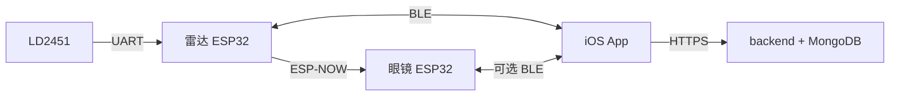

# HackMIT China 2026 — 智能骑行安全系统

**其他语言：** [English](README.en.md)

本说明面向需要**了解项目结构、运行方式与数据流**的读者，便于自行部署与体验。

**仓库根路径（示例）：** `/Users/a11/Documents/HackMITChina2026 finish`

```
HackMITChina2026 finish/
├── 3D printing file/          # 结构件 3D 打印相关文件
├── hardware/
│   └── components.txt         # BOM 物料列表
└── firmware/
    ├── backend/               # Node.js + MongoDB API（Docker）
    ├── bicycle app/           # Xcode / SwiftUI iPhone 客户端
    ├── glassess/              # 雷达桥接 ESP32 固件（.ino）
    └── millimeter-Radar/      # 同上雷达工程（PlatformIO，推荐编译烧录）
```

---

## 一、系统在做什么（工作流概览）

1. **LD2451 毫米波雷达** 通过串口把目标（角度、距离、速度、是否接近等）送给 **雷达端 ESP32**（`millimeter-Radar` / `glassess` 中的桥接逻辑）。
2. **雷达端 ESP32**  
   - 解析雷达帧，筛选威胁目标；  
   - 通过 **BLE** 向 iPhone 推送 JSON 行（雷达帧）；  
   - 通过 **ESP-NOW** 把目标信息发给 **眼镜端 ESP32**；  
   - 接收手机下发的 **`NAV,*`（导航）**、**`BRAKE,*`（减速提示）** 等文本指令。
3. **眼镜端 ESP32**（另一块 C3，固件与眼镜/左右灯相关）通过 ESP-NOW 接收目标与导航包，驱动 **左右警示灯、导航引导灯**。
4. **iPhone App**（`bicycle app`）  
   - 蓝牙连接雷达端（或兼容同一 BLE Service 的外设）；  
   - **地图**：搜索目的地、规划路线、开始导航后向设备发转弯指令；  
   - **安全**：展示危险指数、最近目标、本地危险记录；  
   - **设备**：扫描、连接、查看 RSSI 与帧统计；  
   - **关联人**：邀请码添加监护对象，拉取对方雷达/危险数据（需后端）；  
   - **我的 / 设置**：账号、语言（中/英）、邀请码；**AI 骑行习惯分析** 为 **界面演示**，非真实 AI 模型。
5. **后端**（`firmware/backend`）  
   - 用户注册登录（JWT）、监护列表（邀请码双向关联）；  
   - 接收 App 上报的雷达扫描、计算危险分、落库与查询。



---

## 二、硬件与物料（摘自 `hardware/components.txt`）

| 物料 | 说明 |
|------|------|
| ESP32-C3 ×2 | 一块作雷达桥接，一块作眼镜/灯控（以实际接线为准） |
| LD2451 毫米波雷达 ×1 | 串口输出目标帧 |
| 柔性 LCD 镜片（含 UV 传感器）×1 | 按项目设计使用 |
| 电池 ×2 | 供电 |
| 红 / 蓝 LED 灯带 各 ×2 | 警示与状态 |
| Type-C 充电模块 ×2 | 充电 |
| 3D 打印材料 | 见 `3D printing file/` |

具体引脚、走线以固件源码与实物为准。**ESP-NOW 对端 MAC** 在雷达桥接代码中配置，烧录前需与眼镜端 STA MAC 一致。

---

## 三、各子项目如何运行

### 1. 后端 `firmware/backend`

**技术栈：** Express 5、Mongoose、MongoDB、JWT；使用 **Docker Compose** 启动。

```bash
cd "/Users/a11/Documents/HackMITChina2026 finish/firmware/backend"
docker compose up -d --build
```

- API 默认端口：**3000**  
- MongoDB 端口：**27017**（开发环境常映射到本机；若部署到公网，请自行加固，勿暴露无防护数据库）

**健康检查：** 浏览器或 curl 访问 `http://<服务器IP>:3000/` 应返回 JSON，`status` 为 `ok`。

**主要 API 前缀：**

- `POST /api/auth/register`、`POST /api/auth/login`  
- `POST /api/auth/watch`、`GET /api/auth/watchlist`、`GET /api/auth/me`  
- `POST /api/radar/scan`、`GET /api/radar/danger` 等（需 Bearer Token）

更多说明见 `firmware/backend/docs/`（若存在）。

---

### 2. iOS 客户端 `firmware/bicycle app`

**打开工程：** 双击 `bicycle app.xcodeproj`，建议使用**真机**运行（蓝牙、定位依赖真机）。

**配置后端地址：** 编辑 `bicycle app/AuthService.swift` 中的 `appBackendBaseURL`。仓库内示例可能类似：

```swift
let appBackendBaseURL = "http://172.16.23.215:3000"
```

请改为 **运行 Docker 主机的局域网 IP**，并与手机处于同一网段。若使用 **HTTP**，需在 Xcode **Info** 中为对应域名/IP 配置 **App Transport Security 例外**。

**系统权限：** 蓝牙、定位（地图/导航及部分运动检测）、本地网络（视环境而定）。

**App 使用流程（简介）：**

1. 确保后端已启动，手机网络可访问 API。  
2. 在 App 内 **注册 / 登录**。  
3. **设备**：打开蓝牙 → 搜索 → 连接雷达桥接外设。  
4. **地图**：搜索目的地 → 规划路线 → **开始导航**（可按提示连接眼镜）→ 转弯等指令经 BLE 下发。  
5. **安全**：查看危险指数与记录（数据来自 BLE，并可结合后端轮询）。  
6. **关联人**：使用邀请码添加监护关系（依赖后端）。  
7. **我的 → 设置**：切换界面语言；**AI 骑行习惯分析** 为 **占位演示页**，无真实推理、无额外数据上传。

---

### 3. 雷达固件 `firmware/millimeter-Radar`（推荐）

**工具：** [PlatformIO](https://platformio.org/)（VS Code 插件或 CLI）。

```bash
cd "/Users/a11/Documents/HackMITChina2026 finish/firmware/millimeter-Radar"
pio run -t upload
```

- 默认环境见 `platformio.ini`（如 `adafruit_qtpy_esp32c3`）。  
- 依赖含 **Adafruit NeoPixel** 等。

**Arduino IDE** 可使用 `firmware/glassess/glassescode.ino` 中同源逻辑（注意开发板、串口与库版本）。

烧录后：雷达 UART 接线正确、与眼镜 **ESP-NOW MAC 配对**；手机可扫描 BLE（设备名可能为 `RadarGlasses` 等，以固件为准）。

---

### 4. 眼镜端固件

眼镜所用固件以团队**实际烧录到眼镜主板**的工程为准。请保证：

- 若手机直连眼镜：**BLE Service UUID** 与 App 中约定一致；  
- **ESP-NOW** 与雷达端 `receiverMac`（及对端配置）一致。

---

## 四、部署与联调检查清单

| 步骤 | 检查项 |
|------|--------|
| 1 | `docker compose ps` 中 api、mongo 均为 running |
| 2 | App 能访问 `http://<IP>:3000/` |
| 3 | `AuthService` 中 `appBackendBaseURL` 与当前服务器 IP 一致 |
| 4 | 两块 ESP32 上电，雷达接线正确，串口波特率一致（常见 115200） |
| 5 | ESP-NOW 对端 MAC 已按实机修改并重新烧录 |
| 6 | iPhone 已授权蓝牙与定位，**设备页可连接外设** |
| 7 | 地图可搜索并显示路线；**开始导航** 后硬件灯效与预期一致（若已接灯） |

---

## 五、说明与免责

- **AI 骑行习惯分析**：仅为产品界面演示，**不是**真实机器学习分析，**不构成**专业骑行或医疗建议。  
- 网络 IP、MAC、设备名等会随环境变化，**以你本地修改后的配置为准**。  
- 本文档描述的是本目录下的推荐目录结构与操作方式；若与你手中的分支不一致，以**当前代码**为准。

---

## 六、目录索引

- 根目录：`HackMITChina2026 finish`（或你克隆后的路径）  
- 主要子目录：`firmware/backend`、`firmware/bicycle app`、`firmware/millimeter-Radar`、`firmware/glassess`、`hardware`、`3D printing file`
